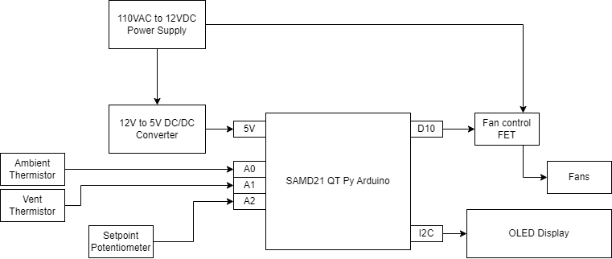
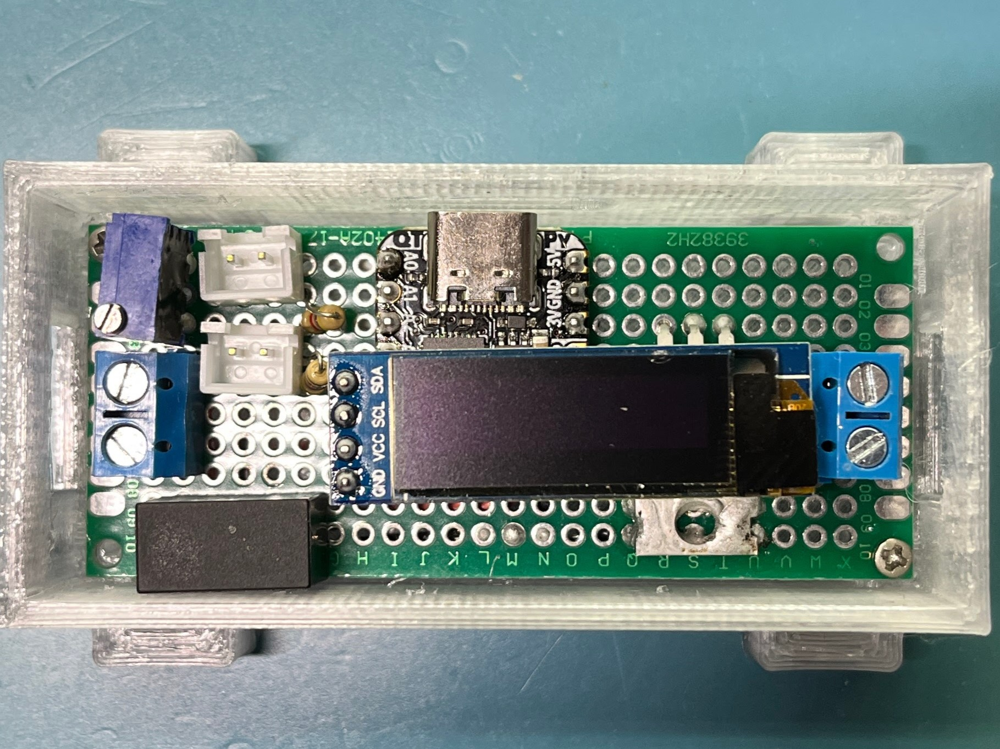
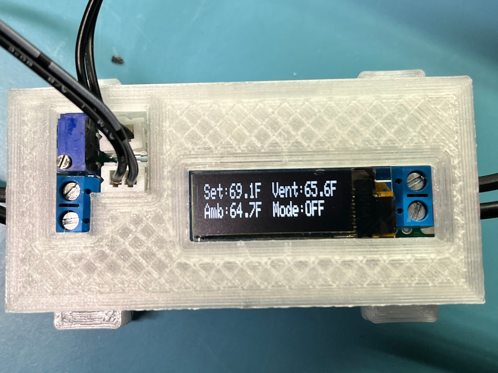
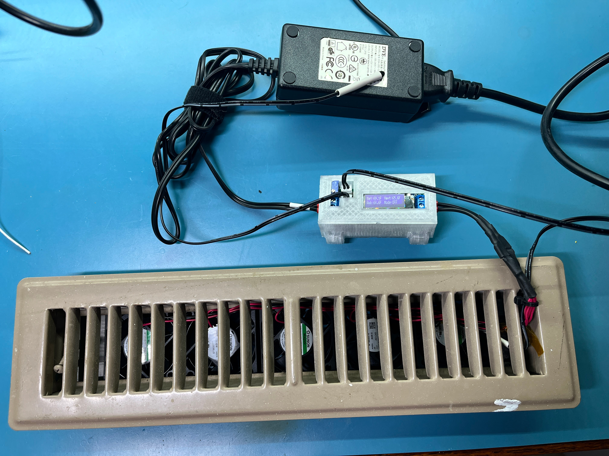

# Vent Booster
This project grew out of not being able to find a vent booster fan that will fit a 2x12 inch HVAC register. The upstairs rooms in our house are underserved by both our AC and furnace, and all the vent registers in our house are these narrow 2x12 inch ones. I've installed a [Suncourt EZ8 Booster](https://www.homedepot.com/p/Suncourt-Equalizer-EZ8-Heating-and-Air-Conditioning-Smart-Register-Booster-Fan-HC600/313922602) in one room, but because it sits on top of the register it doesn't work in areas where furniture sits close to the register or where a booster like this would be a tripping hazard.

Frustrated by this, I decided to DIY a vent booster with some 50mm brushless fans. I found the [Sunon MF50151V1-1000U-A99](https://www.digikey.com/en/products/detail/sunon-fans/MF50151V1-1000U-A99/7652225) would fit nicely below the register, and I 3D printed a bracket to hold five of them underneath the vent register. I removed the register control flapper so that there was more space for the fans.

I whipped up an Arduino controller with some items I had on hand:
* [Adafruit QT Py SAMD21 Arduino board](https://www.adafruit.com/product/4600)
* [Monochrome 128x32px OLED display](https://www.adafruit.com/product/661)
* 5V DC/DC module
* 12V Power supply
* Various terminal blocks, thermistors, connectors, and a FET from the junk bin

The system has the following features:
* Thermistor to sense ambient room temperature
* Thermistor to sense temerature inside the vent
* A potentiometer to set the desired room temperature
* A display to show the current setpoint, temperatures, and operating mode

The ambient and vent temperature sensors are used to detect when the HVAC system is running. When there is a significant delta between these two temperatures, it is assumed that the HVAC is on, and the vent booster turns on.

The setpoint potentiometer was a late add to the system. I found that in some cases the vent booster was too effective and would over-heat or over-cool the room. This would occur when the furnace or AC would run for a long time, e.g. when transitioning from a low overnight thermostat setpoint to a higher daytime setpoint. To avoid this, I added the setpoint potentiometer, which allows setting the desired room temperature. If the booster detects that the HVAC is active, it will turn off once the room is at the desired temperature.

Here's how the system is wired together:

And here's what it looks like as-built and installed into a 3D printed enclosure:

And here's the full system, including the vent register with the fans and thermistor installed in it:

